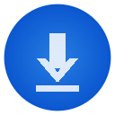
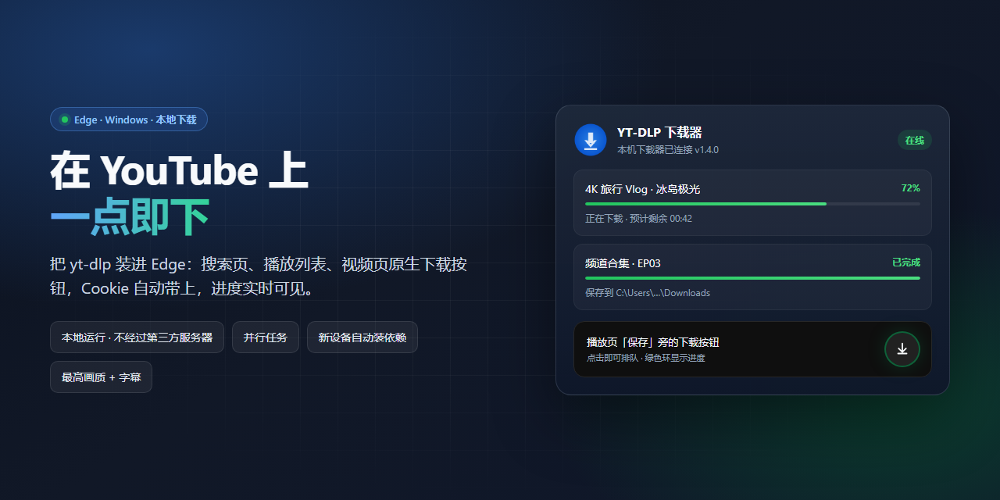
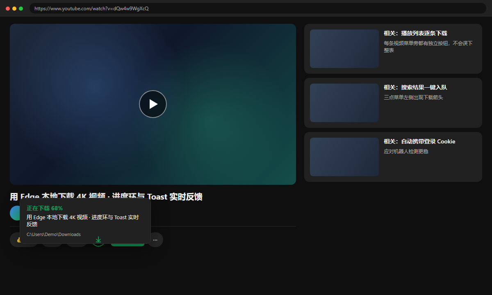
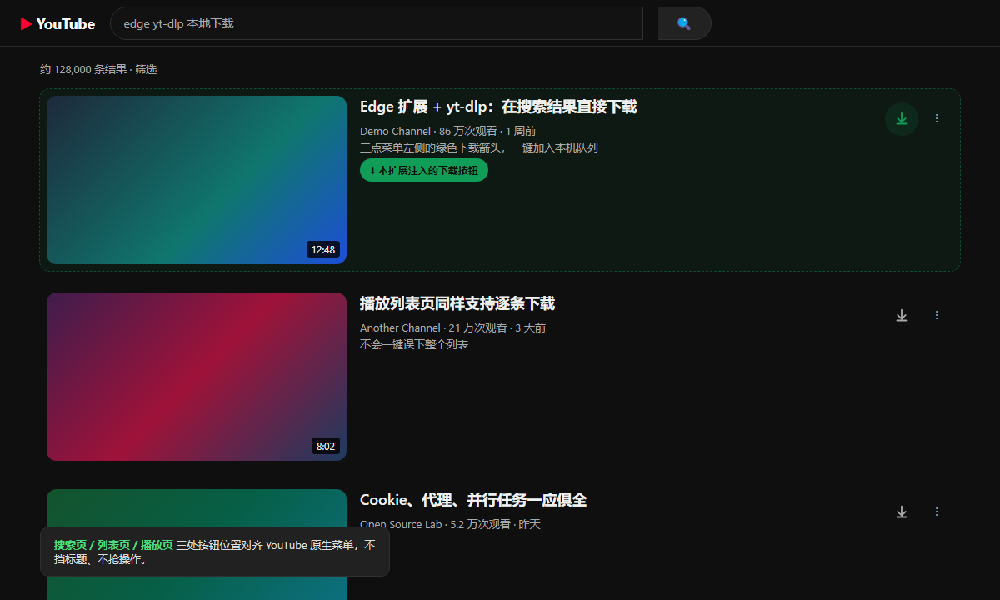
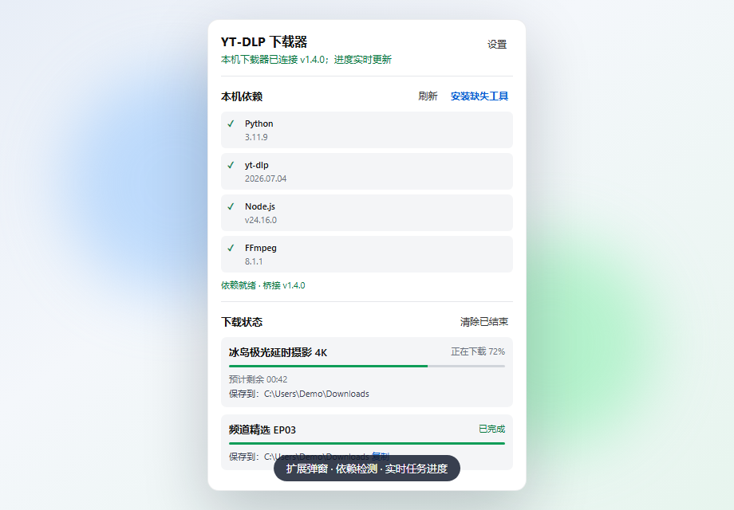

<p align="center">
  
</p>

<h1 align="center">YT-DLP YouTube Downloader for Edge</h1>

<p align="center">
  <strong>把 yt-dlp 装进浏览器 —— 在 YouTube 上一点即下</strong>
</p>

<p align="center">
  搜索页 · 播放列表 · 视频页原生下载按钮<br>
  本机运行 · 自动 Cookie · 实时进度 · 新设备自动装依赖
</p>

<p align="center">
  <a href="https://github.com/Mu-scorpio/edge-ytdlp-youtube-downloader/releases/latest"></a>
  <a href="LICENSE"></a>
  
  
</p>

<p align="center">
  <a href="https://github.com/Mu-scorpio/edge-ytdlp-youtube-downloader/releases/latest"><strong>⬇ 下载最新版 ZIP</strong></a>
  ·
  <a href="#-三分钟上手">快速开始</a>
  ·
  <a href="#-功能亮点">功能</a>
  ·
  <a href="#-常见问题">FAQ</a>
</p>

---



> **不是又一个在线解析站。**  
> 视频、Cookie、字幕和文件都只在你自己的电脑上走完：Edge 扩展负责按钮与状态，本机 `yt-dlp` 负责真正的下载与合并。

---

## 为什么是它

| 你想要的 | 它怎么做 |
| --- | --- |
| 像原生长在 YouTube 上 | 搜索 / 列表 / 播放页直接出下载按钮，不挡标题 |
| 高画质、能合并音视频 | 调用本机 yt-dlp + FFmpeg，默认冲最高质量 |
| 登录视频也能下 | 自动读取当前 Edge 的 YouTube Cookie |
| 看得见进度 | 按钮进度环 + 页面 Toast + 扩展弹窗三层反馈 |
| 换电脑不折腾 | 安装脚本 + 弹窗「安装缺失工具」，自动补齐依赖 |
| 隐私可控 | 无服务器、无上传；Cookie 只进本机临时文件，用完即删 |

---

## 界面一览

### 播放页：保存旁边的下载按钮

进度环、Toast、保存路径一次看清。



### 搜索页：结果旁一键入队

三点菜单左侧的下载箭头，点一下就进本机队列。



### 扩展弹窗：依赖健康 + 任务看板

Python / yt-dlp / Node / FFmpeg 状态一目了然；缺什么就装什么。



---

## 功能亮点

### 三处入口，按钮长在「该在的地方」
- **搜索结果**：每条普通视频的三点菜单左侧  
- **播放列表**：每条视频旁独立下载（不会误下整表）  
- **视频播放页**：夹在「保存」和三点菜单之间  

### 本机火力全开
- 并行任务：连点多个视频 = 多个独立 yt-dlp 进程  
- 实时进度与预计剩余时间  
- 播放页可跟当前字幕轨道一起保存（字幕失败不影响视频）  
- 下载目录默认跟随 Edge 设置  

### 新设备友好（v1.4）
- `setup-native-host.ps1` 尽量自动安装 Python / yt-dlp / Node / FFmpeg  
- 弹窗一键「安装缺失工具」  
- 找不到 `yt-dlp.exe` 时回退 `python -m yt_dlp`  
- 错误信息改成**能照着修**的中文说明  

### 代理与登录
- 默认兼容本机 `socks5h://127.0.0.1:7890`  
- 旧的本地 `http://127.0.0.1:7890` 会自动归一成 SOCKS5H  
- Cookie 走扩展 API，不跟 Edge 抢数据库锁  

---

## 三分钟上手

### 1. 下载并解压

从 [Releases](https://github.com/Mu-scorpio/edge-ytdlp-youtube-downloader/releases/latest) 下载：

```text
edge-ytdlp-youtube-downloader-v1.4.0.zip
```

解压到**不会随便移动或删除**的目录（路径会写进本机桥接配置）。

### 2. 在 Edge 加载扩展

1. 打开 `edge://extensions`  
2. 打开 **开发人员模式**  
3. **加载解压缩的扩展** → 选中含 `manifest.json` 的文件夹  
4. 复制扩展卡片上的 **32 位 ID**（也可稍后在扩展设置页复制安装命令）

### 3. 一键注册本机桥接（并尽量装好工具）

在扩展目录打开 PowerShell：

```powershell
Set-ExecutionPolicy -Scope Process Bypass
.\setup-native-host.ps1 -ExtensionId "你的32位扩展ID"
```

脚本会：
- 检查 / 尝试安装 Python 3.9+  
- `pip install "yt-dlp[default]"`  
- 尝试用 winget 安装 Node.js 与 FFmpeg  
- 注册 Edge Native Messaging Host  

然后：
1. 在 `edge://extensions` **重新加载**扩展  
2. **刷新**已打开的 YouTube 标签页  
3. 点扩展图标，确认显示「本机下载器已连接」

> 只想注册桥接、不自动装工具？加 `-SkipToolInstall`。

### 4. 开始下载

打开任意 YouTube 搜索 / 列表 / 播放页，点向下箭头即可。

---

## 系统要求

| 组件 | 说明 |
| --- | --- |
| Windows 10 / 11 | 当前正式支持 |
| Microsoft Edge | Manifest V3 扩展 |
| Python 3.9+ | 桥接进程；脚本可尝试自动安装 |
| yt-dlp[default] | 含 EJS，解析新版 YouTube 挑战 |
| Node.js | JS 挑战运行时 |
| FFmpeg | 高画质音视频合并（强烈推荐） |

自检命令：

```powershell
python --version
node --version
yt-dlp --version
ffmpeg -version
```

手动升级 yt-dlp：

```powershell
py -m pip install --user --upgrade "yt-dlp[default]"
```

---

## 设置速览

| 选项 | 建议 |
| --- | --- |
| yt-dlp 路径 | 通常留空（自动找 PATH 或 `python -m yt_dlp`） |
| 下载目录 | 留空 = 使用 Edge 下载目录 |
| 代理 | 默认 `socks5h://127.0.0.1:7890`；不需要就清空 |
| Edge Cookie | **保持开启** |
| cookies.txt | 仅自动 Cookie 失败时的备用 |

设置页还可：
- 复制当前扩展 ID 对应的安装命令  
- 测试桥接  
- 安装缺失工具  

---

## 它是怎么工作的

```text
YouTube 页面按钮
      │
      ▼
Edge 扩展后台（Cookie + 任务状态）
      │  Native Messaging
      ▼
native-host.py（本机 Python 桥接）
      │
      ▼
yt-dlp + Node(EJS) + FFmpeg
      │
      ▼
Edge 下载目录（或你指定的路径）
```

扩展只做 UI 与编排；**字节流不经过任何第三方服务器。**

---

## 排错快查

| 现象 | 先试这个 |
| --- | --- |
| 本机桥接器未连接 | 用**当前**扩展 ID 重跑 `setup-native-host.ps1`，再重载扩展 |
| 扩展已更新后按钮失效 | 刷新 YouTube 页面（旧 content script 会失效） |
| Sign in to confirm you're not a bot | 确认 Edge 已登录 YouTube、Cookie 开关开启、代理与浏览器同出口 |
| Requested format is not available | 升级 `yt-dlp[default]`，确认 Node 已装 |
| TLS / SSL EOF | 7890 请用 `socks5h://`，不要用本地 HTTP 代理 |
| 高画质失败 / 无法合并 | 安装 FFmpeg，或在弹窗点「安装缺失工具」 |

桥接日志：

```text
%LOCALAPPDATA%\YT-DLP-Edge\bridge.log
```

---

## 开发者

语法检查：

```powershell
node --check content.js
node --check background.js
node --check options.js
node --check popup.js
python -c "from pathlib import Path; p=Path('native-host.py'); compile(p.read_text(encoding='utf-8'), str(p), 'exec'); print('OK')"
```

打干净 Release 包（白名单打包，不含本机路径 / Cookie / `__pycache__`）：

```powershell
.\build-release.ps1
```

输出：`dist\edge-ytdlp-youtube-downloader-vX.Y.Z.zip`

截图资源位于 `docs/screenshots/`，可用 `docs/mockups/` 里的 HTML 用无头浏览器重新导出。

---

## 隐私

- Cookie 仅从 Edge 传到本机桥接与本机 yt-dlp  
- **没有**项目服务器，也就**不会**上传你的视频或账号数据  
- 临时 Cookie 文件任务结束即删  
- 请勿分享 `cookies.txt`、浏览器 Profile 或含敏感信息的日志包  

---

## 已知限制

- 目前正式支持 **Windows + Edge**  
- 播放列表是**逐条**下载，没有「一键整表」  
- YouTube 会改 DOM / PO Token，未来可能要跟进 yt-dlp 或选择器  
- 默认最高质量时，容器可能是 MP4 / WebM / MKV  

---

## 路线图灵感

欢迎 Issue / PR。如果你在做：
- 强制 MP4 / 画质档位  
- 整表下载  
- 更多站点  

直接开讨论即可。

---

## License

[MIT](LICENSE) —— 自由使用、修改、分发。记得给 yt-dlp / FFmpeg 等上游项目也应有的尊重。

---

<p align="center">
  <sub>Made for people who just want a download button that actually works.</sub><br>
  <a href="https://github.com/Mu-scorpio/edge-ytdlp-youtube-downloader/releases/latest">获取 v1.4.0</a>
</p>
