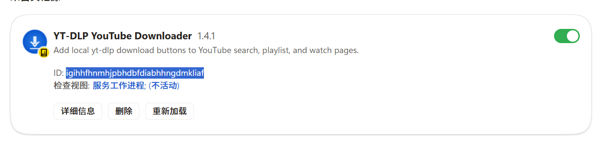

<p align="center">
  
</p>

<h1 align="center">YT-DLP YouTube Downloader for Chrome / Edge</h1>

<p align="center">
  <strong>把 yt-dlp 装进浏览器 —— 在 YouTube 上一点即下</strong>
</p>

<p align="center">
  搜索页 · 播放列表 · 视频页原生下载按钮<br>
  本机运行 · 自动 Cookie · 固定清晰度 · MP4 输出 · 实时进度
</p>

<p align="center">
  <a href="https://github.com/Mu-scorpio/edge-ytdlp-youtube-downloader/releases/latest"></a>
  <a href="LICENSE"></a>
  
  
</p>

<p align="center">
  <a href="https://github.com/Mu-scorpio/edge-ytdlp-youtube-downloader/releases/latest"><strong>⬇ 下载最新版 ZIP</strong></a>
  ·
  <a href="#-macos-三分钟安装">macOS 安装</a>
  ·
  <a href="#-功能亮点">功能</a>
  ·
  <a href="#-排错快查">FAQ</a>
</p>

---


> **不是又一个在线解析站。**
> 视频、Cookie、字幕和文件都只在你自己的电脑上走完：浏览器扩展负责按钮与状态，本机 `yt-dlp` 负责真正的下载与合并。

---

## 为什么是它

| 你想要的 | 它怎么做 |
| --- | --- |
| 像原生长在 YouTube 上 | 搜索 / 列表 / 播放页直接出下载按钮，不挡标题 |
| 高画质、MP4 输出 | 调用本机 yt-dlp + FFmpeg 合并并统一输出 MP4，默认 1080p |
| 登录视频也能下 | 自动读取当前 Chrome / Edge 的 YouTube Cookie |
| 看得见进度 | 按钮进度环 + 页面 Toast + 扩展弹窗三层反馈 |
| 换电脑不折腾 | 安装脚本 + 弹窗「安装缺失工具」，自动补齐依赖 |
| 隐私可控 | 无服务器、无上传；Cookie 只进本机临时文件，用完即删 |

---

## 界面一览

四个画面覆盖完整使用路径：找到视频、选择清晰度、开始下载、查看本机依赖。

<table>
  <tr>
    <td width="50%"></td>
    <td width="50%"></td>
  </tr>
  <tr>
    <td align="center"><sub>播放页：下载按钮自然嵌入 YouTube</sub></td>
    <td align="center"><sub>任务状态：进度、速度和结果清晰可见</sub></td>
  </tr>
  <tr>
    <td width="50%"></td>
    <td width="50%"></td>
  </tr>
  <tr>
    <td align="center"><sub>搜索页：逐条加入本机下载队列</sub></td>
    <td align="center"><sub>弹窗：桥接状态、任务和设置入口</sub></td>
  </tr>
</table>

播放页、搜索页和扩展弹窗都沿用同一套下载状态反馈：按钮、Toast、进度和最终保存路径彼此对应。

---

## 功能亮点

### 三处入口，按钮长在「该在的地方」
- **搜索结果**：每条普通视频的三点菜单左侧
- **播放列表**：每条视频旁独立下载（不会误下整表）
- **视频播放页**：夹在「保存」和三点菜单之间

### 本机火力全开
- 并行任务：连点多个视频 = 多个独立 yt-dlp 进程
- 实时进度与预计剩余时间
- 播放页可跟当前字幕轨道一起保存（字幕失败不影响视频）
- 下载目录默认跟随当前浏览器设置

### 清晰度手动选择（v1.8）
- 下载弹窗使用固定下拉框，不再为了列出可用清晰度而等待网络探测
- 支持 2160p、1440p、1080p、720p、480p、360p、最高质量和仅音频
- 默认选择 1080p；视频不提供所选分辨率时，yt-dlp 会自动回退到可用格式

### 普通视频统一输出 MP4
- 普通视频下载完成后由 yt-dlp / FFmpeg 合并或转码为 MP4
- 选择「仅音频」时保持音频输出，不会强行生成视频文件
- 需要安装 FFmpeg；弹窗可以直接诊断并安装缺失依赖

### 新设备友好（v1.5）
- Windows 使用 `setup-native-host.bat`，macOS 使用 `setup-native-host.sh`；都支持交互输入扩展 ID，并尽量自动安装 Python / yt-dlp / Node / FFmpeg
- 弹窗一键「安装缺失工具」
- 找不到 `yt-dlp` 时回退 `python -m yt_dlp`
- 错误信息改成**能照着修**的中文说明

### 代理与登录
- 默认兼容本机 `socks5h://127.0.0.1:7890`
- 旧的本地 `http://127.0.0.1:7890` 会自动归一成 SOCKS5H
- Cookie 走扩展 API，不跟浏览器抢数据库锁

---

## macOS 三分钟安装 🍎

macOS 推荐使用 Release 里的 `connect-native-host.command`。它会自动找到当前项目目录、注册 Native Messaging 桥接器，并在首次运行后保存扩展 ID；以后换浏览器配置或重新加载扩展时，再双击一次即可重新绑定。

### 1. 下载并放到固定目录

从 [最新 Release](https://github.com/Mu-scorpio/edge-ytdlp-youtube-downloader/releases/latest) 下载 `edge-ytdlp-youtube-downloader.zip`，解压到一个不会被移动的目录，例如：

```text
~/Applications/edge-ytdlp-youtube-downloader/
```

不要直接从「下载」目录运行后再移动文件夹；桥接清单会记录扩展目录的绝对路径。

### 2. 加载 Chrome / Edge 扩展

1. Chrome 打开 `chrome://extensions`；Edge 打开 `edge://extensions`
2. 打开右上角 **开发人员模式**
3. 点击 **加载解压缩的扩展**，选择刚才解压出的、包含 `manifest.json` 的文件夹
4. 确认 **YT-DLP YouTube Downloader** 已启用

### 3. 双击自动连接桥接器

双击扩展目录里的：

```text
connect-native-host.command
```

首次运行时，脚本会要求粘贴扩展卡片上的 **32 位 ID**。ID 只包含 `a`–`p`，例如 `igihhfhnmhjpbhbdfdiabhngdmkliaf`。脚本随后会：

- 检查并尽量安装 Python、yt-dlp、Node.js、FFmpeg
- 生成带绝对路径的本机桥接启动器
- 把当前 ID 写入 Chrome / Edge 的 Native Messaging 白名单
- 保存 ID 到扩展目录的 `.extension-id`，方便以后自动连接
- 打开扩展管理页，提醒你重新加载扩展

如果 macOS 提示无法打开未知开发者的文件：右键 `connect-native-host.command` → **打开**；或在终端执行：

```bash
cd ~/Applications/edge-ytdlp-youtube-downloader
chmod +x connect-native-host.command
./connect-native-host.command --browser chrome
```

使用 Edge：

```bash
./connect-native-host.command --edge
```

脚本也支持直接传 ID，不需要交互输入：

```bash
./connect-native-host.command 你的32位扩展ID --browser chrome
```

### 4. 重新加载并开始下载

1. 回到 `chrome://extensions` 或 `edge://extensions`
2. 点击扩展卡片上的 **重新加载**
3. 刷新已经打开的 YouTube 页面
4. 点击扩展图标，确认显示「本机下载器已连接」
5. 在 YouTube 页面点击下载按钮，清晰度下拉框默认是 **1080p**，普通视频最终保存为 **MP4**

> `.extension-id` 只保存在本机，已被 `.gitignore` 排除，不会进入 GitHub 仓库。

### macOS 依赖自检

脚本会尽量自动处理依赖；如果你想手动安装，推荐使用 Homebrew：

```bash
brew install python@3.11 node ffmpeg
python3 -m pip install --user --upgrade "yt-dlp[default]"
```

检查环境：

```bash
python3 --version
node --version
yt-dlp --version
ffmpeg -version
```

---

## 三分钟上手（Windows / 手动注册）

### 1. 下载并解压

从 [Releases](https://github.com/Mu-scorpio/edge-ytdlp-youtube-downloader/releases/latest) 下载：

```text
edge-ytdlp-youtube-downloader.zip
```

解压到**不会随便移动或删除**的目录（路径会写进本机桥接配置）。

### 2. 在 Chrome / Edge 加载扩展

1. Chrome 打开 `chrome://extensions`，Edge 打开 `edge://extensions`
2. 打开右上角 **开发人员模式**
3. 点击 **加载解压缩的扩展** → 选中含 `manifest.json` 的文件夹
4. 确认扩展卡片出现，并保持开关为 **开启**

### 3. 复制扩展 ID（绑定桥接前必做）

Chrome / Edge 为「解压加载」的扩展生成一串 **32 位 ID**（只含字母 `a`–`p`）。
本机桥接器必须把这个 ID 写进 Native Messaging 白名单，**否则扩展连不上本机 yt-dlp**。

在浏览器扩展管理页找到 **YT-DLP YouTube Downloader** 卡片，复制 **ID:** 后面的整串字符：



上图中的 ID 只是示例；每台电脑、每个浏览器配置的 ID 都可能不同。

示例：

| 项目 | 示例值 |
| --- | --- |
| 扩展名 | YT-DLP YouTube Downloader |
| **ID** | `igihhfhnmhjpbhbdfdiabhngdmkliaf`（你的会不同） |

要点：

- ID 必须是 **恰好 32 个字符**，且只能是 **`a`–`p`**
- **每台电脑 / 每次重新「加载解压缩的扩展」** 都可能得到不同 ID
- 换目录、删掉重装、换 Edge 配置后，请用**新的** ID 重新跑安装脚本
- 设置页也可复制带当前 ID 的安装命令

### 4. 用扩展 ID 注册本机桥接

把上一步复制的 ID **绑定**到本机 Native Messaging Host。任选一种方式：

#### macOS

macOS 优先双击扩展目录里的 `connect-native-host.command`；它会自动询问并保存 ID。也可以在扩展目录打开终端，手动执行：

```bash
chmod +x setup-native-host.sh
./setup-native-host.sh 你的32位扩展ID --browser chrome
```

当前这台电脑使用 Chrome；如果你安装并使用 Edge，把 `chrome` 改成 `edge`。

只想注册桥接、不自动装工具时加 `--skip-tools`：

```bash
./setup-native-host.sh 你的扩展ID --browser chrome --skip-tools
```

脚本会把 Native Messaging 清单写入当前浏览器的用户目录，并生成带绝对 Python 路径的启动器；因此不依赖 Finder 启动 Chrome 时的 PATH。

#### Windows

1. 双击扩展目录里的 `setup-native-host.bat`
2. 窗口提示输入扩展 ID 时，**粘贴**刚才复制的 32 位 ID，回车
3. 等脚本跑完；成功或失败时窗口会暂停，方便查看输出
4. 按任意键关闭

#### Windows 命令行传参

在扩展目录打开 **命令提示符**（资源管理器地址栏输入 `cmd` 回车），执行：

```bat
setup-native-host.bat 你的32位扩展ID
```

把 `你的32位扩展ID` 换成真实 ID，例如：

```bat
setup-native-host.bat igihhfhnmhjpbhbdfdiabhngdmkliaf
```

> 只想注册桥接、不自动装工具？加 `--skip-tools`：
> `setup-native-host.bat 你的扩展ID --skip-tools`

脚本会：

- 校验扩展 ID 格式
- 检查 / 尝试安装 Python 3.9+
- `pip install "yt-dlp[default]"`
- 在 Windows 尝试用 winget 安装 Node.js 与 FFmpeg；在 macOS 尝试用 Homebrew 安装
- 写入带绝对路径的 Native Messaging 启动器与 `com.local.ytdlp_downloader.json`
- 将该 ID 加入 `allowed_origins`；Windows 写注册表，macOS 写浏览器的 `NativeMessagingHosts` 目录

#### 注册完成后

1. 回到浏览器扩展管理页，点 **重新加载**
2. **刷新**已打开的 YouTube 标签页
3. 点扩展图标，确认显示「本机下载器已连接」

若提示未连接：多半是 **ID 绑错或过期**——重新复制当前 ID，再运行对应系统的安装脚本。

### 5. 开始下载

打开任意 YouTube 搜索 / 列表 / 播放页，点向下箭头即可。

---

## 系统要求

| 组件 | 说明 |
| --- | --- |
| macOS 12+（Intel / Apple Silicon） | 当前正式支持；Chrome / Edge 均可 |
| Windows 10 / 11 | Edge + `setup-native-host.bat` |
| Google Chrome / Microsoft Edge | Manifest V3 扩展 |
| Python 3.9+ | 桥接进程；脚本可尝试自动安装 |
| yt-dlp[default] | 含 EJS，解析新版 YouTube 挑战 |
| Node.js | JS 挑战运行时 |
| FFmpeg | 普通视频转 MP4 及音视频合并（必需） |

macOS 自检命令：

```bash
python3 --version
node --version
yt-dlp --version
ffmpeg -version
```

手动升级 yt-dlp：

```bash
python3 -m pip install --user --upgrade "yt-dlp[default]"
```

---

## 设置速览

| 选项 | 建议 |
| --- | --- |
| yt-dlp 路径 | 通常留空（自动找 PATH 或 `python -m yt_dlp`） |
| 下载目录 | 留空 = 使用当前浏览器下载目录 |
| 代理 | 默认 `socks5h://127.0.0.1:7890`；不需要就清空 |
| 浏览器 Cookie | **保持开启** |
| cookies.txt | 仅自动 Cookie 失败时的备用 |

设置页还可：
- 复制当前扩展 ID 对应的安装命令
- 测试桥接
- 安装缺失工具

---

## 它是怎么工作的

```text
YouTube 页面按钮
      │
      ▼
浏览器扩展后台（Cookie + 任务状态）
      │  Native Messaging
      ▼
native-host.py（本机 Python 桥接）
      │
      ▼
yt-dlp + Node(EJS) + FFmpeg
      │
      ▼
当前浏览器下载目录（或你指定的路径）
```

扩展只做 UI 与编排；**字节流不经过任何第三方服务器。**

---

## 排错快查

| 现象 | 先试这个 |
| --- | --- |
| 本机桥接器未连接 | 在浏览器扩展管理页复制**当前** 32 位 ID，运行对应系统的安装脚本，再**重新加载**扩展 |
| 双击 bat 一闪就关 / 不知道填什么 | 已支持无参数双击后提示输入 ID；若仍闪退请用 `cmd` 运行并查看报错 |
| 扩展已更新后按钮失效 | 刷新 YouTube 页面（旧 content script 会失效） |
| Sign in to confirm you're not a bot | 确认当前浏览器已登录 YouTube、Cookie 开关开启、代理与浏览器同出口 |
| Requested format is not available | 升级 `yt-dlp[default]`，确认 Node 已装 |
| TLS / SSL EOF | 7890 请用 `socks5h://`，不要用本地 HTTP 代理 |
| 无法输出 MP4 / 无法合并 | 安装 FFmpeg，或在弹窗点「安装缺失工具」 |

桥接日志：

```text
macOS: ~/Library/Logs/YT-DLP-Edge/bridge.log
Windows: %LOCALAPPDATA%\YT-DLP-Edge\bridge.log
```

---

## 开发者

语法检查：

```bash
node --check content.js
node --check background.js
node --check options.js
node --check popup.js
python3 -c "from pathlib import Path; p=Path('native-host.py'); compile(p.read_text(encoding='utf-8'), str(p), 'exec'); print('OK')"
```

打干净 Release 包（白名单打包，不含本机路径 / Cookie / `__pycache__`）：

```bash
./build-release.sh
```

输出：`dist/edge-ytdlp-youtube-downloader.zip`（文件名不含版本号）

截图资源位于 `docs/screenshots/`，可用 `docs/mockups/` 里的 HTML 用无头浏览器重新导出。

---

## 隐私

- Cookie 仅从当前浏览器传到本机桥接与本机 yt-dlp
- **没有**项目服务器，也就**不会**上传你的视频或账号数据
- 临时 Cookie 文件任务结束即删
- 请勿分享 `cookies.txt`、浏览器 Profile 或含敏感信息的日志包

---

## 已知限制

- 目前正式支持 **macOS + Chrome / Edge**，以及 **Windows + Edge**
- 播放列表是**逐条**下载，没有「一键整表」
- YouTube 会改 DOM / PO Token，未来可能要跟进 yt-dlp 或选择器
- 普通视频会统一输出 MP4；仅音频模式按音频格式输出

---

## 路线图灵感

欢迎 Issue / PR。如果你在做：
- 整表下载
- 更多站点

直接开讨论即可。

---

## License

[MIT](LICENSE) —— 自由使用、修改、分发。记得给 yt-dlp / FFmpeg 等上游项目也应有的尊重。

---

<p align="center">
  <sub>Made for people who just want a download button that actually works.</sub><br>
  <a href="https://github.com/Mu-scorpio/edge-ytdlp-youtube-downloader/releases/latest">获取 v1.8.0</a>
</p>
