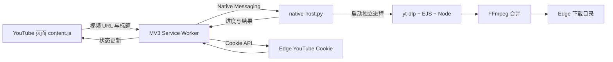

# YT-DLP YouTube Downloader for Edge

一个面向 Windows 和 Microsoft Edge 的本地 YouTube 下载扩展。它会在 YouTube 搜索页、播放列表页和视频播放页加入下载按钮，并通过 Native Messaging 调用电脑上的 `yt-dlp`。

扩展只负责界面、Cookie 获取和任务状态展示；视频下载、音视频合并以及文件保存都由本机 `yt-dlp`/FFmpeg 完成。

## 功能

- 搜索页：每条普通视频结果的三点菜单左侧显示下载按钮。
- 播放列表页：每条视频的三点菜单旁显示下载按钮，下载的是该条视频，不会一次下载整个列表。
- 视频播放页：在“保存”和三点菜单之间显示下载按钮。
- 自动读取当前 Edge 的 YouTube 登录 Cookie，应对登录验证和机器人检测。
- 显示连接、排队、下载进度、完成路径和错误信息。
- 每次点击创建独立的 `yt-dlp` 进程，支持并行下载。
- 下载目录留空时，自动使用 Edge 当前配置的下载目录。
- 支持自定义 `yt-dlp.exe`、下载目录、代理地址和备用 `cookies.txt`。
- 默认兼容本机 `127.0.0.1:7890` 代理。

## 系统要求

- Windows 10/11
- Microsoft Edge
- Python 3.9+
- 最新版 `yt-dlp`，并安装默认依赖和 EJS 组件
- Node.js 22+
- FFmpeg（下载高画质视频时用于合并音视频）

建议先检查：

```powershell
python --version
node --version
yt-dlp --version
ffmpeg -version
```

使用 PyPI 安装时，请安装 `default` 依赖组，否则新版 YouTube 的 JavaScript 挑战可能无法解析：

```powershell
py -m pip install --user --upgrade "yt-dlp[default]"
```

## 安装

### 1. 下载并解压

从 Releases 下载 `edge-ytdlp-youtube-downloader-v1.1.0.zip`，解压到一个不会移动或删除的永久目录。

不要直接从压缩包运行，也不要在完成 Native Host 注册后移动目录。

### 2. 在 Edge 加载扩展

1. 打开 `edge://extensions`。
2. 开启“开发人员模式”。
3. 点击“加载解压缩的扩展”。
4. 选择包含 `manifest.json` 的目录。
5. 复制扩展卡片上的 32 位扩展 ID。

### 3. 注册 Native Messaging Host

在插件目录打开 PowerShell，执行：

```powershell
.\setup-native-host.ps1 -ExtensionId "你的32位扩展ID"
```

如果 PowerShell 阻止本地脚本，可仅对这次进程放宽策略：

```powershell
Set-ExecutionPolicy -Scope Process Bypass
.\setup-native-host.ps1 -ExtensionId "你的32位扩展ID"
```

脚本会：

- 生成与当前电脑路径绑定的 `native-host.cmd`。
- 生成与扩展 ID 绑定的 `com.local.ytdlp_downloader.json`。
- 写入注册表 `HKCU\Software\Microsoft\Edge\NativeMessagingHosts\com.local.ytdlp_downloader`。

完成后在 `edge://extensions` 重新加载扩展，并刷新已经打开的 YouTube 页面。

### 4. 配置

点击扩展图标进入设置：

- `yt-dlp` 路径：通常留空；如果不在 `PATH` 中，填写 `yt-dlp.exe` 完整路径。
- 下载目录：留空时使用 Edge 的下载目录。
- 代理地址：默认 `socks5h://127.0.0.1:7890`；不需要代理时清空。
- 自动使用 Edge Cookie：建议保持开启。
- `cookies.txt`：只作为自动读取失败时的备用方案。

## 使用

刷新 YouTube 页面后，以下位置会出现向下箭头：

- 搜索结果视频的三点菜单左侧。
- 播放列表中每条视频的三点菜单旁。
- 视频播放页“保存”和三点菜单之间。

按钮状态：

- 绿色进度环：正在下载。
- 绿色完成状态：下载成功。
- 红色状态：下载失败，页面左下角会显示错误详情。

扩展弹窗会显示最近任务、进度、最终文件路径以及本机桥接器状态。

## 架构



主要文件：

- `content.js` / `content.css`：按钮注入、点击交互、进度和 Toast。
- `background.js`：任务存储、Cookie 读取、Native Messaging 长连接。
- `native-host.py`：校验 URL、创建临时 Cookie 文件、调用 `yt-dlp`、解析进度。
- `setup-native-host.ps1`：生成本机专用 Native Host 配置并注册到 Edge。
- `popup.*` / `options.*`：任务列表和设置页面。

## 开发中踩过的坑（重要）

这一节记录本项目实际遇到的问题。二次开发前建议完整阅读。

### 1. 网页脚本不能直接执行本机 `yt-dlp`

浏览器扩展没有权限直接创建 Windows 进程。正确链路是：

`content script → background service worker → Native Messaging → Python → yt-dlp`

Native Messaging 使用标准输入/输出传递消息，每条 JSON 前必须带 4 字节小端长度。Python 的 `stdout` 只能输出协议消息，普通日志必须写入文件或 `stderr`，否则会直接破坏通信。

### 2. Native Host 注册成功不等于扩展一定能连接

以下三项必须同时正确：

1. 注册表默认值必须指向 Native Host JSON 的绝对路径。
2. JSON 中的 `path` 必须指向可执行启动器的绝对路径。
3. `allowed_origins` 必须精确匹配 `chrome-extension://扩展ID/`。

解压目录变化、重新加载到不同路径、扩展 ID 改变，都会导致连接失败。修改扩展 ID 后应重新执行 `setup-native-host.ps1`。

### 3. Manifest V3 Service Worker 会休眠，事件可能早于页面监听器

仅依赖一次 `runtime.sendMessage` 容易出现“本机已经开始下载，页面仍显示正在连接”。本项目同时采用：

- Native Messaging 长连接；
- 后台持久化最近任务；
- 页面每 750ms 查询一次当前任务；
- 后台主动广播下载更新。

这样即使 Service Worker 重启或页面错过了第一条事件，仍能恢复任务状态。

### 4. `Extension context invalidated` 通常不是下载器崩溃

在 `edge://extensions` 重新加载扩展后，旧 YouTube 标签页里的 content script 已失效。旧页面继续点击就会出现 `Extension context invalidated`。

解决办法是重新加载扩展后刷新所有已经打开的 YouTube 页面。开发阶段每次改 `manifest.json`、`background.js` 或 `content.js` 都要记住这一点。

### 5. 不要把用户给出的完整 XPath 当成长期选择器

YouTube 是 SPA，DOM 层级、`div[n]` 和渲染器索引经常变化。完整 XPath 只能帮助确认视觉位置，不适合直接写进插件。

本项目使用语义节点组合：

- 搜索页：`ytd-video-renderer` 与内部 `ytd-menu-renderer`；
- 播放列表：新版 `yt-lockup-view-model`，同时兼容旧 `ytd-playlist-video-renderer`；
- 播放页：`ytd-watch-metadata ytd-menu-renderer`。

注入逻辑同时监听 `MutationObserver`、`yt-navigate-finish`、`popstate`，并在导航后的 250/750/1500/3000ms 做补充扫描。每个按钮带页面类型标记，防止重复注入。

### 6. YouTube 搜索、播放列表和播放页使用三套不同组件

不能假设所有页面都有 `a#video-title` 或相同菜单结构。新版播放列表标题通常位于 `yt-lockup-metadata-view-model`，播放页的视频 URL 则应直接读取当前地址栏。

提取标题时应优先使用可见文本，最后才使用 `aria-label`，否则文件名可能额外带上“16秒钟”一类无障碍描述。

### 7. Trusted Types 会拦截 `innerHTML`

YouTube 页面启用了 Trusted Types。通过 `innerHTML` 创建下载 SVG，在某些执行环境会报：

`This document requires 'TrustedHTML' assignment`

本项目使用 `createElementNS`、`createElement` 和 `append` 构建图标，避免依赖 `innerHTML`。

### 8. Edge 正在运行时，`--cookies-from-browser edge` 可能读不到 Cookie

直接让 `yt-dlp` 读取 Edge Cookie 数据库，常见错误是数据库被浏览器锁定或无法复制。扩展已经拥有 `cookies` 权限，因此更可靠的做法是：

1. 后台通过 `chrome.cookies.getAll({ domain: "youtube.com" })` 读取当前会话；
2. 只在本机 Native Host 中转换成临时 Netscape Cookie 文件；
3. 传给 `yt-dlp --cookies`；
4. 下载结束后立即删除临时文件。

日志只记录 Cookie 数量，不记录 Cookie 值。不要把 Cookie、`cookies.txt` 或浏览器资料目录提交到 Git。

### 9. `Sign in to confirm you're not a bot` 不一定代表用户没登录

这是 YouTube 对出口 IP、客户端指纹和会话状态的综合校验。即使 Edge 已登录，如果 Cookie 没传到 `yt-dlp`、代理出口不同或 Cookie 已过期，仍会出现该提示。

优先检查：自动 Cookie 是否开启、日志中的 `browserCookies` 是否大于 0、代理是否和浏览器使用同一出口。

### 10. 7890 的 HTTP 代理模式可能出现 TLS EOF

项目中实际遇到：

`SSL: UNEXPECTED_EOF_WHILE_READING`

同一个 Clash mixed-port 使用 `http://127.0.0.1:7890` 时 TLS 隧道不稳定，改用 `socks5h://127.0.0.1:7890` 后恢复。插件会把旧的本地 HTTP 7890 设置自动归一化为 SOCKS5H，并增加网络、提取器和分片重试。

这条转换只针对本机 7890；其他代理地址保持用户配置不变。

### 11. `Requested format is not available` 有两个完全不同的根因

第一类是电脑上的全局 yt-dlp 配置强制了不存在的格式，所以本项目始终传入 `--ignore-config`。

第二类是新版 YouTube JavaScript challenge/PO Token 变化导致 yt-dlp 只拿到 storyboard 图片，没有真正的视频格式。仅安装 Node 不够；PyPI 版 yt-dlp 还必须安装 `yt-dlp-ejs`。推荐：

```powershell
py -m pip install --user --upgrade "yt-dlp[default]"
```

本项目同时启用 `--js-runtimes node` 和 `--remote-components ejs:github` 作为兜底。YouTube 的 PO Token 策略仍在变化，出现格式异常时第一步应升级 `yt-dlp[default]`。

### 12. 为什么有些文件是 WebM 或 MKV，而不是 MP4

插件默认让 yt-dlp 选择最高质量。比如 4K AV1 视频加 Opus 音频，最终可能合并为 WebM；AVC/AV1 与其他音频组合也可能合并为 MKV。这不是下载失败。

如果强制 MP4，需要增加格式选择和 `--merge-output-format mp4`，但可能牺牲最高码率、4K 可用性或触发重新编码。二次开发时应把“最高质量”和“最大兼容性”作为可配置选项，而不是无条件强制扩展名。

### 13. Edge 下载目录不应硬编码

浏览器下载目录可能不是 `%USERPROFILE%\Downloads`。Native Host 会读取 Edge Profile 的 `Preferences` 中 `download.default_directory`，读取失败才回退到 Windows 默认下载目录。

如果用户在扩展设置里明确填写目录，则以用户设置为准。

### 14. `__pycache__` 会让 Edge 拒绝加载整个扩展

在扩展目录执行 `python -m py_compile native-host.py` 会生成 `__pycache__`。Edge 对扩展目录中的下划线保留名称有限制，会提示：

`Filenames starting with "_" are reserved for use by the system`

发布前必须删除 `__pycache__` 和 `.pyc`。本仓库使用不落盘的 `compile()` 做 Python 语法检查，并在 `.gitignore` 和打包白名单中双重排除缓存文件。

### 15. 图标方向和交互反馈必须真实验证

“箭头向上”在视觉上会被理解为上传。下载图标应是箭头向下并指向横线。仅仅点击后禁用按钮也不够，用户还需要知道：是否已连接、是否进入队列、下载百分比、保存位置和失败原因。

本项目通过按钮进度环、页面 Toast 和扩展弹窗三层反馈解决这个问题。

### 16. 每次可交付迭代都要更新版本号并清理旧桥接进程

Manifest 版本用于确认 Edge 实际加载了哪一版；Native Host 版本会写入 `bridge.log` 并在 ping 响应中返回。只改代码不改版本号，很难判断用户运行的是旧代码还是新代码。

更新 Native Host 后，应重新加载扩展或结束旧桥接进程，确保新 Python 文件被重新载入。

## 日志与排错

Native Host 日志：

```text
%LOCALAPPDATA%\YT-DLP-Edge\bridge.log
```

日志包含：桥接版本、消息类型、任务 ID、输出目录、代理/Cookie 是否启用、yt-dlp PID 和退出码。日志不会记录 Cookie 值。

常用检查：

```powershell
Get-Content "$env:LOCALAPPDATA\YT-DLP-Edge\bridge.log" -Tail 100
yt-dlp --version
yt-dlp --list-impersonate-targets
Test-NetConnection 127.0.0.1 -Port 7890
```

## 开发与验证

JavaScript 语法检查：

```powershell
node --check content.js
node --check background.js
node --check options.js
node --check popup.js
```

不会生成 `__pycache__` 的 Python 检查：

```powershell
python -c "from pathlib import Path; p=Path('native-host.py'); compile(p.read_text(encoding='utf-8'), str(p), 'exec'); print('OK')"
```

发布前人工检查：

1. 搜索页每条普通视频只有一个按钮。
2. 播放列表每条视频只有一个按钮，位于三点菜单旁。
3. 播放页按钮位于“保存”和三点菜单之间。
4. YouTube 站内导航后按钮会重新出现，不刷新也不会重复。
5. 下载任务能显示进度、完成路径和错误。
6. 并行点击两个视频时会创建两个独立任务。
7. Release ZIP 根目录直接包含 `manifest.json`。
8. ZIP 不包含 `.git`、日志、Cookie、`native-host.cmd`、Native Host JSON、`__pycache__` 或 `.pyc`。

## 构建干净 Release ZIP

```powershell
.\build-release.ps1
```

输出：

```text
dist\edge-ytdlp-youtube-downloader-v1.1.0.zip
```

打包脚本使用文件白名单，不会把本机生成的 Native Host 路径、扩展 ID、测试缓存或 Git 元数据放进压缩包。

## 隐私与安全

- Cookie 仅从 Edge 传给本机 Native Host 和本机 yt-dlp。
- Cookie 不上传到本项目服务器；本项目没有服务器。
- 临时 Cookie 文件在任务结束后删除。
- Native Host 只接受 `https://youtube.com/watch?v=...` 及其标准子域链接。
- 无论 URL 是否含 `list` 参数，都会附加 `--no-playlist`，避免误下载整个播放列表。
- 请勿分享 Cookie、`cookies.txt`、浏览器 Profile 或包含这些内容的日志包。

## 已知限制

- 目前只正式支持 Windows + Edge。
- 播放列表页面提供逐条视频下载，不提供“一键下载整个列表”。
- YouTube 会持续调整 DOM、EJS 和 PO Token 策略，未来可能需要更新选择器或 yt-dlp。
- 默认选择最高质量，最终容器可能是 MP4、WebM 或 MKV。

## License

[MIT](LICENSE)
